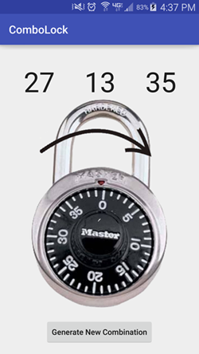
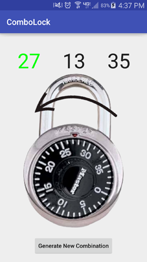
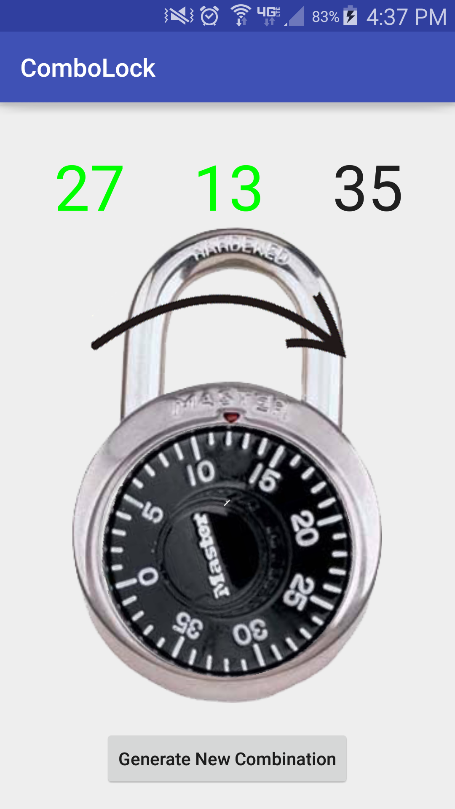
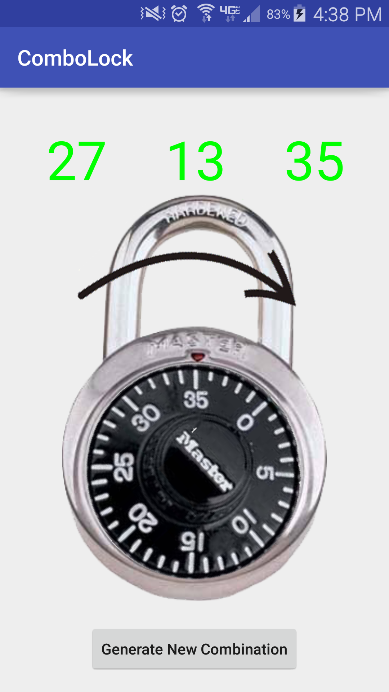
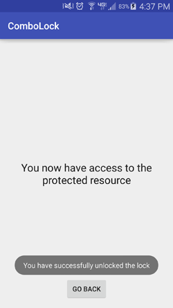

# ComboLock
An android app that models a combination lock. The user must rotate their phone in order to match the combination and unlock the lock. Upon unlocking the lock, a secret message will be shown

This was a group project for CS480S (Smart Devices and Sensing)
Binghamton University
Professor Wang

# About
* This app utilizes a device's gyroscope to determine the current degrees the device has turned and rotate a combination lock accordingly
* Every degree of rotation corresponds to a 'tick' on the combination lock
* The goal is to unlock the combination lock by tilting the device side to side

# Installing
1. Get the apk from this repository (under release/)
2. Depending on your device, you  might need to allow installing from unknown sources
3. Download the apk to your device and click to open it
4. You should be prompted to install it

# Using the app
* The application behaves almost identically to a regular combination lock
* There is a black arrow that tells the user which way to turn the device in order to get to the next combination number
* Upon launching the app a random combination will be generated
* Tilt the device right to get to the first number, the number will turn green when you have landed on it
* Tilt the device left to get to the second number, the number will turn green when you have landed on it
* Tilt the device right to get to the third number, the number will turn green when you have landed on it and you will be brought to a secret screen
* From here you can view the secret message and go back to the main app screen and generate a new random combination
* It is best if the user holds the phone un-tilted when resetting
* You must be steadily on the correct number in order for the app to accept it as being correct
*NOTE: If you overshoot the number you can't go backwards to get the number, you must do a full circle*

# Future Work
This app shows proof of concept and lays the groundwork for the items listed below

* Allow user to specify their own combo that will be used to unlock the lock, instead of randomly generating combos
* Actually lock a resource on the phone
* Allow this app to be the new lock screen?

# Contributors
* Conor Cunningham
* Matthew Sausner
* Harris Pittinsky
* Cody Dynarski (photoshopping the image)

# Misc
* Multiple screens not supported
* Compiles on android studio 2.1

# Known Bugs
* Generate new combo after hitting back button messes up reset (it doesn't go to 0)

**Required Binghamton Plagiarism Statement:**
*"We have done this assignment completely on my own. We have not copied it, nor have We given my solution to anyone else. Weunderstand that if we are involved in plagiarism or cheating we will have to sign an official form that we have cheated and that this form will be stored in my official university record. We also understand that we will receive a grade of 0 for the involved assignment for our first offense and that we will receive a grade of “F” for the course for any additional offense."*
